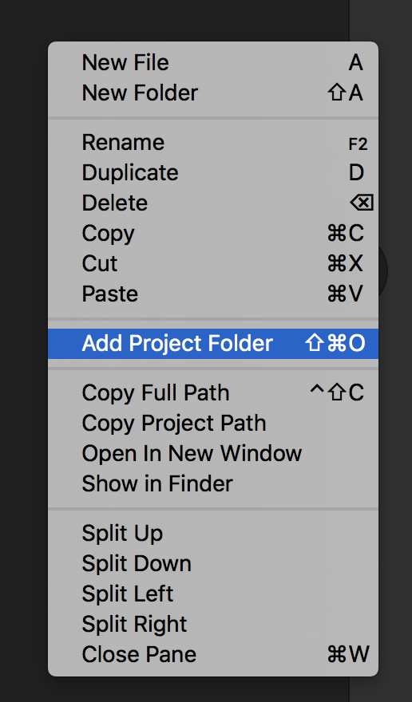
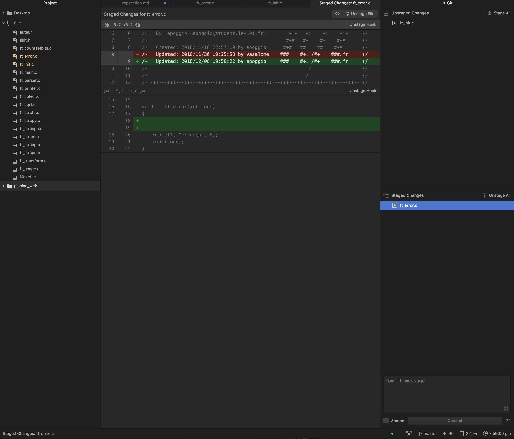
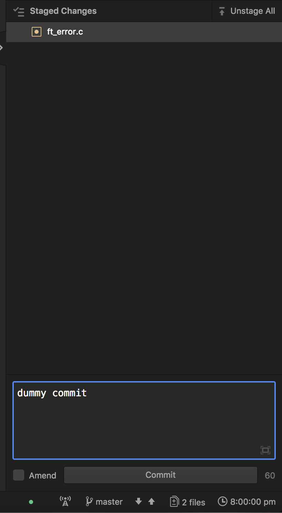
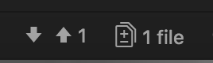
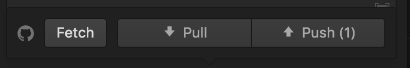

# Contenu pedagogique des days:

### Repartition par stud:

| day    | login_1 | login_2 |
|--------|:---------:|:---------:|
| 00     |      epoggio   | vasalome        |
| 01     |    mchapard     |  srepelli       |
| 02     |    shthevak     |    nobody sorry     |
| 03     |    ftourret     |    fleonard     |
| 04     |     shthevak    |    vischlum     |
| RUSH00 |    ALL     |     ALL    |

## D00
- Qu'est ce qu'un éditeur de texte?
	- presentation de Xcode *1 (VScode / Atom / ...)*
- Qu'est ce que le Versionning ? / comment utiliser git ?
	- Presentation de Git Kraken (ou autre solution *2*) et de son utilisation
- Qu'est ce qu'un langage de balisage?
	- Presentation de html / Présentation des interpreteur (firefox/chrome)
	- Presentation des balises de structure
		- DOCTYPE
		- html
		- head
			- meta
			- title
		- body
	- Presentation des balises de internes
		- p br strong em i
		- h1, h2, h3, ...
		- a (href) faire un lien avec un page local ou externe.
		- img (src) + svg
		- hr
		- ul,ol,li
		- table tr th td (peut-on generer du code)
		- ...
	- Presentation des balises multimedia
		- video audio (source)
		- ...
	- Presentation des balises structuration par zone de page
		- header
		- nav
		- section
		- article
		- aside
		- footer
		- (indice pour bootstrap)
		- ...
	- Concept inline/block/inline-block
		- div
		- span
- Qu'est ce qu'un standard html ?
	- html 5 et utilisation d'un [validator](https://validator.w3.org/)
	- checker l'indentation (ou utiliser un [indentateur](http://tab-it.fr/))

## D01
- Comment mettre du style une page ?
	- Presentation des Cascading style sheets.
		- Explication de l'héritage avec un DOM Tree d'un HTML
	- Différent moyen d'utilisation d'un style
		- inline
		- balise style in header
		- fichier separé .css balise link
- Comment généraliser ou specifier un style?
	- presentation des .classes et des #id.
- Les attribut CSS, leurs valeurs communes, leurs selecteur et pseudo-classes.
	- font
		- font-family
			- serif | sans-serif | monospace & Arial | Helvetica | Times
		- font-weight
			- normal | italic
		- [...]
	- text
		- text-align
			- left | right | center | justify
		- color
			- rgb | hex | name
		- text-decoration
			- underline | overline | line-through | blink | none
		- [...]
	- background
		- background-img
			- url
		- background-color
		 	- ...
	- margin, border, padding
		- width top | right | bottom | left
			- 50px | 50% | 50pt | 50ex | 50cm | 50in
		- style
		- color
	- table
		- collapse
		- spacing
		- vertical-align
	- visibility, display
		- visible | hidden
		- none | inline | block
	- position
		- static | relative | absolute | fixed
	- float , clear
		left | right | both | none
	- a
		- :hover :visited :link :active :focus
- Comment importer un css de l'extérieur ou d' un framework?
	- link et son attribut media (print, screen, ...) & @media.
	- introduction à bootstrap pour structurer un page
	- Faire un bar de navigation. *3*
- Utiliser des operateurs sur les selecteurs:
	- p em
	- div *
	- .lol > .foo
	- ul + li

## D02
- Consolidation et récapitulatif intermédiare
	- html
		- Structure, balise, inline-block ...
	- CSS
		- selecteurs, attribut, import & css inline ...
- Comment rendre une page web dynamique et interactive?
	- langage de description (JS, Jquery) VS (HTML5, CSS3)
	- presentation de jquery et de javascript
	- Comment utiliser un langage de script dans un HTML
	- Introduction au concept de **var** & **type** (implicite)
		- quel nom donner aux variables ?
		- quel opérateur utiliser avec quel type et quel resultat obtient-on ?  
	- Introduction aux fonctions **getby**() id class ... & document.write() | alert()
	- Presentation de l'attribut onclick
	- bootstrap autres élèment ??? (structures de pages par class)

## D03
- Comment debug son JS ?
	- Présentation de la Console
- Comment récupérer et traiter de l'information en local ?
	- présentation des bales HTML des de formulaires
	- interactions entre un formulaire et un js pour faire des opérations sur les inputs
	- comment prompt dans un script ??
- Peut on faire intéragir le CSS avec JS?
	- Creer faire des animations simples.
- Comment avoir des comportements conditionnels?
	- introduction à l'instruction if et switch.
		- operateurs conditionnel et booleen | default value break

## D04
- Comment repeter plusieurs fois une instruction en JS ou Jquery?
	- Introduction au boucle.
- Comment localiser nos processus et les appeler plusieurs fois?
	- introduction au fonction.
		- variable global vs variable local vs parametre de fonction
- comment stocker plusieurs information dans une structure ?
 	- introduction aux tableau d'element.
	- fonctions speciques et attribut aux tab ...
- Comment capter les evenement de la page ?
	- onclick | ondblclick | onmouseover | onmouseout | onkeydown | onload | onchange

## RUSH00
- Site vitrine / portefolio
	- Introdution au git hub pages pour mettre faicilement en ligne.
	- Explication de ce qu'est un registar pour avoir son propre nom de domaine ...

## RUSH01
On pourrait avoir deux sujet de rush au choix soit le site vitrine soit un jeu en javascript pour
ceux qui voudraient

### *Commentaires / propositions*:

- *1* : ou autre selon les choix pour la solution de versionning...
- *2* : on pourrait utiliser atom car c'est un all in one qui nous permet de faire l'édition de code et le versionning dans une seule fenêtre (et hackable / open source / ... et cool)
	-  

		en effet on peut ajouter simplement un dossier de projet à atom.
			

				
			

		

	- 

		L'interface permert de connaitre les changement fait sur in fichier avec un
		git diff assez explicite. Elle permet de `git add` ou de `git rm` d'un simple double click.
	

		
	

	

	- 

		l'interface permet aussi de faire un `git commit` explicite dans un box simple d'usage. Et même elle permet d'`amend`. (Voir elle permet de `git checkout file` avec un icone poubelle)  
	

		
	

	

	- 

	L 'interface montre où on en est dans nos commits et permet un `git push` simplifié après l'enregistrement des 	logins.
	

		
		
	

	

	- Le seul désavantage que je vois serait le `git clone` (mais il peut facilement être regler avec ce type de [package](https://atom.io/packages/git-clone) par exemple).

- *3* : j'ai noté ca rapidement mais je sais plus à quoi ça correspond.
